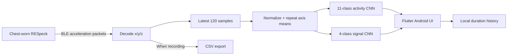

# RESpeck Wearable Activity Recognition

[](https://github.com/Russwang/respeck-activity-recognition/actions/workflows/ci.yml)

**Wearable sensing → Bluetooth Low Energy → on-device CNN inference → Android UI.**

A University of Edinburgh MSc coursework project extending a supplied Flutter data-collection app with real-time activity and respiratory/social-signal classification. TensorFlow/Keras trains compact 1D CNNs; TensorFlow Lite runs them locally on Android using chest-worn RESpeck accelerometer data.

[中文代码导览](docs/代码与模型导览.md) · [Model contract](docs/MODELS.md) · [Course scope & attribution](docs/COURSE_CONTEXT.md) · [Validation & remaining gaps](docs/PROJECT_STATUS.md)

## What the project demonstrates

- **Sensor integration:** BLE discovery, packet decoding, sliding-window buffering and optional CSV recording.
- **Time-series ML:** 120-sample windows, 30-sample training stride, per-axis standardization and axis means as six input channels.
- **Evaluation:** recording-grouped cross-validation and class weighting to address unequal class frequency.
- **Edge deployment:** two bundled float32 TFLite models, explicit label manifests and runtime tensor-shape validation.
- **Application engineering:** structured predictions, millisecond history accounting, lifecycle handling and regression tests.

The course supplied the acquisition app. This repository contains the extended application and training code; it does not claim that the original Flutter/BLE scaffold was built from scratch.

## Architecture



The app uses accelerometer data, not audio or video. The camera is only used for sensor QR pairing. Inference does not need a cloud service. Both models run after each complete BLE packet once their windows are full; device latency and battery use have not been benchmarked in this revision.

## Scope and historical results

| Task | Current model classes | Historical evaluation |
| --- | --- | --- |
| Physical activity | 11; sitting and standing combined | 90.53% mean accuracy, 0.9048 macro-F1; 12,061 windows; 5 folds |
| Respiratory/social signals | Normal breathing, coughing, hyperventilation, other | 70.21% mean accuracy, 0.6866 macro-F1; 41,523 windows; 3 folds |

Evidence: [physical report](results_physical_cnn_v2/cv_classification_report.txt), [signal report](results_social_cnn_v3/cv_classification_report.txt). These are **saved historical results**, not a new evaluation or measured phone accuracy. Folds group by recording file, not participant. The original data and training-run metadata are missing, so the reports cannot currently be reproduced or conclusively tied to a particular training run. See the [model provenance notes](docs/MODELS.md).

The course specification lists 12 activities and six social signals. This implementation uses reduced label sets and does not claim complete coverage of that specification.

## Repository map

```text
pdiot_har_example/           Flutter app and platform projects
  lib/models/               Predictions and six-channel preprocessing
  lib/services/             TFLite window classifier and history accounting
  lib/ble.dart              RESpeck connection and packet handling
  lib/home.dart             Main UI, recording and persistence
  assets/                   Two deployed models and JSON manifests
  test/                     Dart unit and widget regression tests
physical_model_leave_n_cv.py Physical CNN training and evaluation entry point
social_model_leave_n_cv.py   Signal CNN training and evaluation entry point
training_utils.py           Shared Python preprocessing, CLI and export metadata
results_*/                  Preserved historical reports, mappings and models
scripts/verify_models.py    Hash, tensor, label and real-inference checks
tests/                      Python preprocessing and loader tests
docs/                       Architecture, provenance and validation notes
.github/workflows/ci.yml    Flutter tests, Android debug build and model checks
```

## Run on Android

Tested locally with Flutter **3.35.5 / Dart 3.9.2**. The app requires Android **10 / API 29** or newer, an Android SDK, a connected phone and a compatible RESpeck (`Res6AL` or `ResV5i`).

```sh
cd pdiot_har_example
flutter pub get
flutter devices
flutter run -d <android-device-id>
```

1. In **Settings**, enter Subject ID and the RESpeck UUID, or scan its QR code; save the pairing.
2. Wake the sensor and enable Bluetooth. Grant requested Bluetooth permissions.
3. Press **Connect**. Predictions appear after the 120-sample buffer fills.
4. **Start recording / Stop recording** control CSV recording separately from inference. The destination folder appears in Settings.
5. **History** displays observed classified durations. Old unreliable history is retained in storage but not mixed into the new totals.

```sh
flutter build apk --debug
```

The debug APK is a development build, not a signed production release. Android compilation passed in [GitHub Actions](https://github.com/Russwang/respeck-activity-recognition/actions/runs/36677904214) on 30 September 2026. Download the [debug APK artifact](https://github.com/Russwang/respeck-activity-recognition/actions/runs/36677904214/artifacts/11080014108) (GitHub sign-in may be required; artifacts expire under repository retention settings). Local compilation still needs the missing Android SDK. A 2025 APK found in a local build folder is not published as the result of these changes.

## Python setup and training

Use Python **3.10 or 3.11**:

```sh
python3 -m venv .venv
source .venv/bin/activate
pip install -r requirements.txt
python -m unittest discover -s tests -v
python scripts/verify_models.py
```

Training needs separately supplied recordings arranged as `dataset/<class-name>/*.csv` with `accelX`, `accelY`, `accelZ` columns. Raw participant recordings are not published.

```sh
python physical_model_leave_n_cv.py --data-dir /path/to/daily_activity --output-dir training_outputs/physical_run1
python social_model_leave_n_cv.py --data-dir /path/to/social_signal --output-dir training_outputs/social_run1
```

Optional parameters: `--folds`, `--epochs-cv`, `--epochs-final`, `--seed`. Output directories must be empty, protecting historical artifacts from accidental overwrite. Each run exports metrics, label mapping, SavedModel, TFLite and a matching model manifest. Follow [the deployment checklist](docs/MODELS.md) before replacing app assets.

## Checks

```sh
cd pdiot_har_example
flutter analyze
flutter test
```

See [PROJECT_STATUS.md](docs/PROJECT_STATUS.md) for the checked revision's local test results, missing files and remaining hardware validation. Synthetic model smoke tests verify execution and output validity; they do not establish recognition quality.
